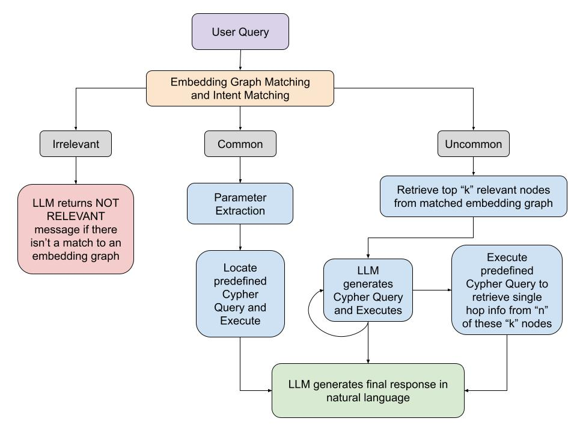

# KPMG Data Science Capstone Project

## Project Overview

Data-driven decision making is the driving force of business in the digital age. However, a reliance on black-box methodologies with little transparency presents a myriad of risks. This project aims to mitigate these risks by providing easy access to digital records. We took a pre-existing metadata chatbot model (created through a collaboration between the Columbia Data Science Institute and KPMG in Spring 2024) and implemented several improvements to enhance the accuracy, relevance, and robustness of chatbot responses. 

Our chatbot version employs GraphRAG to capture nuanced variable relationships across KPMG databases, 
models, and reports. Via the chatbot UI, users can ask questions about company data and receive natural 
language responses, occasionally accompanied by informative relationship graphs.

We have enabled self-reflection and single-hop functionality which allow for more consistent and accurate responses. This project uses Neo4j for the graph database and LangChain and the OpenAI LLM (gpt-4) for Cypher query generation and natural language output. 



## Team Structure

1. Daniel Clepper
2. William Holden
3. Shreya Kurdukar
4. Selim Shaalan
5. Keerthi Srilakshmidaran
6. Akshay Venkatesan 

## Setting Up the Development Environment

1. Clone the project repository to your local machine:

```
git clone https://github.com/av3157/msds-capstone-kpmg.git
cd msds-capstone-kpmg
```

2. Create and Activate a Virtual Environment

On Windows, create a virtual environment run `python -m venv chatbot-venv` and activate it by `.\chatbot-venv\Scripts\activate`
On macOS/Linux, create the virtual environment: create a virtual environment by running `python3 -m venv chatbot-venv` and activate it by `source chatbot-venv/bin/activate`

Note:
- To exit the virtual environment, run `deactivate`
- To re-enter the environment run the same command when you previously activated it

3. Install Project Dependencies

```
pip install -r requirements.txt
```

4. Define environmental variables

Create a `.env` file in the root of the package and define variables like the following:

```
NEO4J_URI=uri
NEO4J_USER=user
NEO4J_PASSWORD=password
OPENAI_API_KEY=api_key
```

Note:
- Credentials for Neo4j are the same as those when connecting to your instance in the Neo4j console: https://console.neo4j.io/
- To get an OpenAI API key, go to the following link, setup an account, and generate an API key: https://openai.com/blog/openai-api

4. Running the Application

To run the StreamLit app locally, execute the following command which is essentially running the root file of our project (app.py): `streamlit run code/app.py`.

## Ask the Chatbot Questions!

When asking the chatbot questions, make sure they are relevant to the database. 
Here are some sample questions:
- What report fields are downstream of PerformanceScore column?
- What are the performance metrics of Customer Satisfaction Prediction Model?
- Name all of the report fields in the Financial Health Dashboard report.
- List all users who work on Inventory Management Report and their contributions.
- How was the Sales Confidence Interval report field calculated?
- What is the difference between the latest version and the previous version of the Employee Productivity Prediction Model?
- What are the top features of the the Inventory Management Prediction Model?
- Tell me about the latest version of the Financial Health Prediction Model.
- How many versions of the Sales Performance Prediction Model are there?
- Who are the creators of the Sales Performance Dashboard Report?

## Resources

- OpenAI Chat Text Generation: https://platform.openai.com/docs/guides/text-generation/chat-completions-api
- Neo4j Connecting to Python: https://neo4j.com/docs/aura/aurads/connecting/python/
- Neo4j Python Guide: https://neo4j.com/docs/getting-started/languages-guides/neo4j-python/
- Neo4j DB QA Chain: https://python.langchain.com/docs/use_cases/graph/graph_cypher_qa#add-examples-in-the-cypher-generation-prompt
- Building RAG using LangChain: https://python.langchain.com/docs/tutorials/rag/ 
